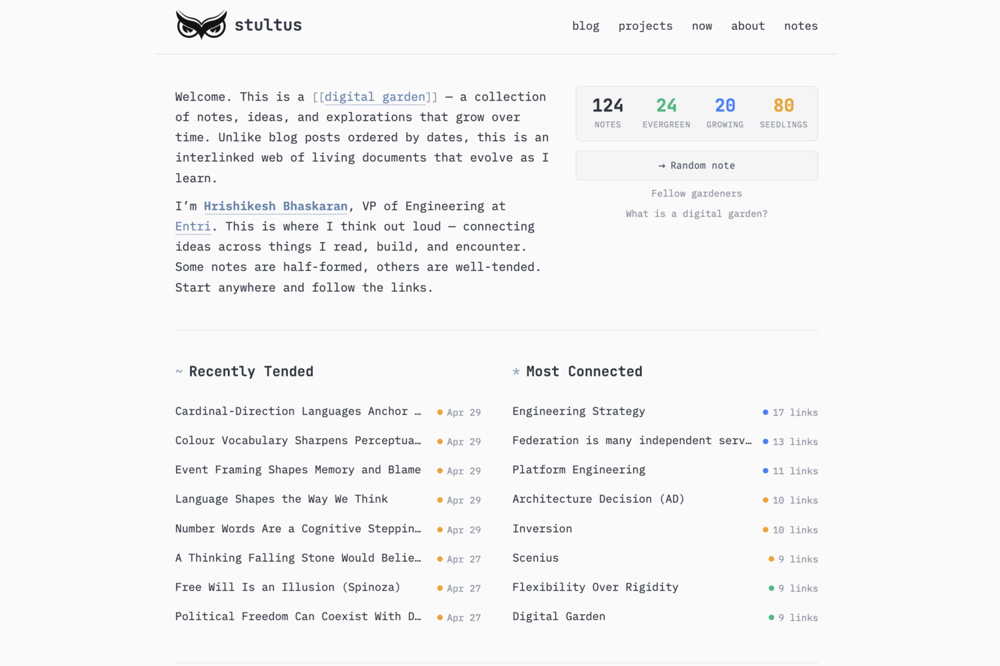

# Kavu

> Named after the കാവ് (kavu), the sacred groves of Kerala: small, protected, deliberately overgrown.

<!-- TODO: replace with a dedicated network-graph screenshot once one is captured -->


A monospace, terminal-inspired Hugo theme for digital gardens and personal knowledge bases. Designed around the principles of interconnected note-taking, with support for note maturity stages, network graph visualization, and dense cross-linking.

**Live site**: [stultus.in/notes](https://stultus.in/notes/)

## Features

**Homepage**
- Live garden statistics (total notes, evergreen/growing/seedling counts)
- Recently Tended and Most Connected entry points
- Collapsible topic cards for browsing by theme
- Filterable and sortable full note index
- Random note discovery button
- Interactive network graph with search, hover highlighting, and fullscreen mode

**Note Pages**
- Inline metadata bar: maturity status, dates, reading time
- Summary subtitle and tag pills
- Automatic backlinks with summaries
- Random note navigation

**Tag System**
- Tag cloud with note counts
- Sortable tag pages (Recent / A-Z / Status)
- Related tags discovery based on co-occurrence

**Network Graph**
- Force-directed graph of all notes and their connections
- Hover to highlight a node and its neighbors with labels
- Label collision avoidance
- Search, zoom, fit-to-view, and fullscreen controls
- Keyboard shortcuts: `/` search, `F` fit, `Shift+F` fullscreen, `+`/`-` zoom

**Design**
- Monospace typography (JetBrains Mono, IBM Plex Mono, Fira Code)
- Nord-inspired color palette with CSS variables
- Full dark mode support
- Responsive layout
- Wikilink-style `[[bracket]]` rendering for internal links
- Malayalam font support (Manjari)

## Note Maturity

Notes use a `status` frontmatter field to indicate maturity:

| Status | Meaning |
|--------|---------|
| `seeding` | Stub or rough idea |
| `growing` | Developed draft, partially linked |
| `evergreen` | Polished, well-linked, stable understanding |

## Getting Started

```bash
# Add as a submodule
git submodule add git@github.com:stultus/kavu.git themes/kavu
```

Set in `hugo.toml`:
```toml
theme = "kavu"
themesdir = "./themes"
```

### Frontmatter

```yaml
---
title: "Your Note Title"
date: 2025-01-01
lastmod: 2025-01-15
draft: false
tags: ["topic-a", "topic-b"]
summary: "One-line description of the note."
status: "seeding"  # seeding | growing | evergreen
type: "note"       # note | essay | moc | source
---
```

### Internal Links

Use absolute paths for internal links to ensure the theme's link resolver works correctly:

```markdown
[Note Title](/notes/note-slug/)
```

## Origin

Kavu was originally forked from [paulmartins/hugo-digital-garden-theme](https://github.com/paulmartins/hugo-digital-garden-theme), which was inspired by [Maggie Appleton's website](https://maggieappleton.com/). It has since been substantially rewritten with a new design system, homepage, note pages, tag system, network graph, and CSS architecture.

## License

MIT
